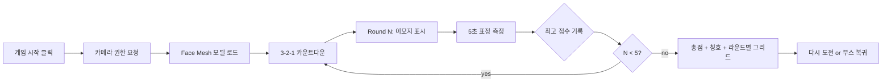

# 😀 표정 대장 챌린지 (Face Emoji Master)

> **웹캠 앞에서 이모지 표정을 따라하는 5라운드 챌린지!**
> Google MediaPipe Face Mesh로 얼굴 랜드마크 468개를 실시간 분석해 표정 일치도를 0~100점으로 측정합니다.

[](https://face-emoji-master.vercel.app/)
[](https://developers.google.com/mediapipe/solutions/vision/face_landmarker)
[](#)

---

## 🎮 게임 소개

5라운드에 걸쳐 화면이 제시하는 이모지 표정(😀😮😱😉😴)을 따라하는 표정 대결 게임입니다.
얼굴 랜드마크 좌표만으로 점수를 계산하므로 **모든 처리가 사용자 브라우저 내에서 이루어지며 데이터가 외부로 전송되지 않습니다**.

### ✨ 주요 특징

- 🎯 **5라운드 타임어택** — 라운드당 5초 제한
- 📊 **실시간 점수 바** — 매 프레임 일치도 시각화
- 🏆 **칭호 시스템** — 총점에 따라 5단계 칭호
- 🎨 **글래스모피즘 + 오로라 UI** — 부스 메인과 통일된 디자인
- 🔒 **개인정보 보호** — 영상은 로컬에서만 처리, 서버 전송 없음
- ♿ **`prefers-reduced-motion`** 지원

---

## 🚀 바로 플레이

👉 **[https://face-emoji-master.vercel.app/](https://face-emoji-master.vercel.app/)**

> ⚠️ PC + 웹캠 환경 권장 · 카메라 권한 허용 필요

---

## 🎭 표정 5종 + 점수 산출 알고리즘

| 이모지 | 표정 | 핵심 지표 |
|--------|------|----------|
| 😀 | 활짝 웃기 | `mouth_width / face_width` 정규화 (0.42~0.58) |
| 😮 | 입 쩍 벌리기 | `vertical_lip_distance / face_height` (0.04~0.18) |
| 😱 | 깜짝 놀라기 | √(mouth_open × eye_open) — AND 조건 |
| 😉 | 한쪽 윙크 | ∛(closed × open × gap) — 비대칭 검출 |
| 😴 | 눈 감고 자기 | 1 − EAR 평균 정규화 (0.14~0.26) |

**EAR (Eye Aspect Ratio):** `vertical / horizontal` 눈 비율, 표준 ≈ 0.30 (열림) / < 0.18 (감김)

**스무딩:** `liveScore = liveScore * 0.5 + raw * 100 * 0.5` (50/50 EMA)로 깜빡임·미세 떨림 안정화

---

## 🏆 칭호 시스템

| 총점 | 칭호 | 메시지 |
|------|------|-------|
| 400+ | 🤩 표정의 신 | 당신의 얼굴이 곧 예술입니다! |
| 300+ | 😎 표정 마스터 | 표정 연기력 만렙! |
| 200+ | 😊 표정 챌린저 | 꽤 잘 따라하셨어요! |
| 100+ | 🌱 표정 새싹 | 조금만 더 과감하게! |
| <100 | 🙂 표정 신입생 | 다음 도전을 기대합니다! |

---

## 🛠️ 기술 스택

| 분류 | 기술 |
|------|------|
| **AI 모델** | [MediaPipe Face Mesh](https://google.github.io/mediapipe/solutions/face_mesh.html) (468 landmarks, refineLandmarks=true) |
| **카메라** | MediaPipe Camera Utils + getUserMedia |
| **프론트엔드** | Vanilla JavaScript (단일 `index.html`) |
| **스타일링** | Tailwind CSS (CDN) + 커스텀 글래스/오로라 |
| **타이포그래피** | Pretendard |
| **호스팅** | Vercel (정적 웹사이트, GitHub 연동 자동 배포) |

> 💡 백엔드 서버 없음 · 빌드 도구 없음 · `index.html` 단일 파일

---

## 📦 로컬 실행

```bash
git clone https://github.com/tigerjk9/face-emoji-master.git
cd face-emoji-master
python -m http.server 8000
# 브라우저에서 http://localhost:8000 접속
```

> 💡 카메라 권한 정책상 `file://` 직접 열기보다 **로컬 서버 사용 권장**.

---

## 🎬 게임 흐름



---

## 📁 저장소 구성

```
face-emoji-master/
├── README.md       # 본 문서
├── index.html      # 단일 파일 게임 (HTML + CSS + JS 통합)
└── .gitignore      # .vercel 폴더 제외
```

---

## 🔒 개인정보·보안

- 모든 영상 처리는 **사용자 브라우저 내에서 완결**됩니다.
- 얼굴 랜드마크 좌표·점수·결과 이미지는 **외부 서버로 전송되지 않습니다**.
- 카메라 스트림은 페이지 종료 시 자동으로 해제됩니다.
- HTTPS(Vercel)에서 카메라 권한이 동작합니다.

---

## 📝 변경 이력

| 날짜 | 내용 |
|------|------|
| 2026-04-19 | 📚 CLAUDE.md + PRD.md 추가 (개발 컨텍스트 + 요구사항) |
| 2026-04-19 | 초기 출시 (5라운드 표정 챌린지, MediaPipe Face Mesh 468 landmarks, 5종 표정, 5단계 칭호, 글래스모피즘 + 오로라 디자인, 외부 전송 0건) |
| 2026-04-19 | AI Hands-On Booth v2 게임 섹션 첫 번째 카드로 등록 |

---

## 🌟 향후 개선 아이디어

- [ ] 결과 화면 캡처 → SNS 공유용 이미지 다운로드
- [ ] 표정 종류 추가 (😘 키스, 😡 화남, 😋 혀 내밀기)
- [ ] 난이도 조절 (Easy 5초 / Hard 3초)
- [ ] 친구와 동시 도전 멀티 모드
- [ ] 라운드 영상 GIF 캡처

---

## 🔗 관련 프로젝트

본 게임은 [AI Hands-On 부스](https://ai-hands-on-booth-v2.vercel.app/)에 등록된 10개 AI 체험 중 하나입니다.

| 시리즈 | 부스 메인 |
|--------|-----------|
| 🍌 나노 바나나 사진관 4종 + 🎮 웹캠 게임 6종 | [ai-hands-on-booth-v2.vercel.app](https://ai-hands-on-booth-v2.vercel.app/) |

---

## 🙏 크레딧

- **Google MediaPipe Face Mesh** — 실시간 얼굴 랜드마크 검출
- **Tailwind CSS** · **Pretendard**

---

## 📝 라이선스

MIT License - 자유롭게 사용·수정·재배포 가능합니다.

---

## 👤 제작자

**김진관 (닷커넥터)**
- GitHub: [@tigerjk9](https://github.com/tigerjk9)
- Linktree: [litt.ly/dot_connector](https://litt.ly/dot_connector)

---

> 😀 **지금 바로 [표정 대장 챌린지](https://face-emoji-master.vercel.app/)에 도전해 「표정의 신」 칭호를 노려보세요!**
